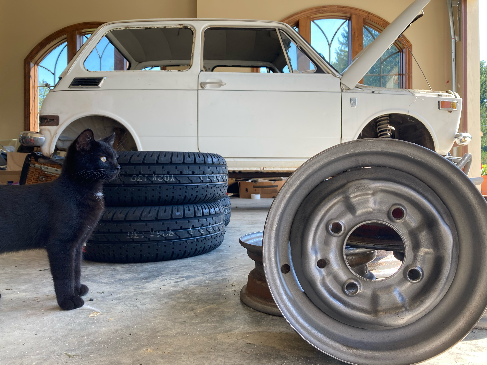
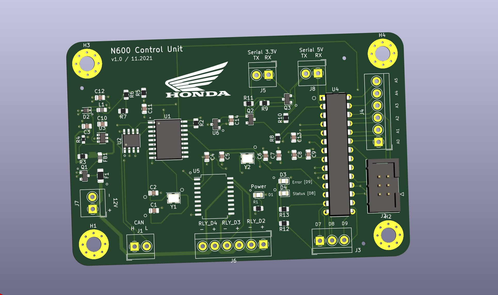
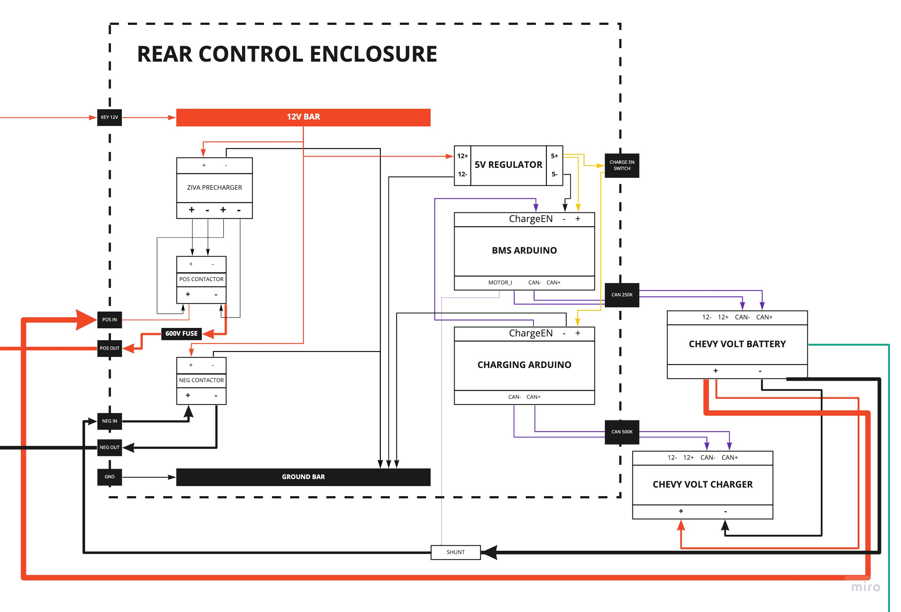
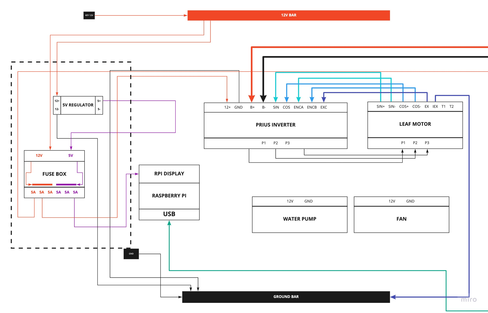

# Honda N600 EV Conversion

All control systems and dash UI code.

## Master Control Unit
Communicates (via CAN) to the BMS, controls fan, and coolant pumps, monitors temperature.

## Dash Screen UI

### Requirements

* [Kikad](https://www.kicad.org/)
* [Node.js/NPM](https://nodejs.org/en/download/)

### Dev Setup

* Within the dash-screen/server directory, Run: _npm install_ to download dependencies
* Within the dash-screen/ui directory, Run: _npm install_ to download dependencies
* Run: _npm start_ within the dash-screen/ui directory
* Run: _npm start_ within the dash-screen/server directory
* After the build process finishes, you should see a chrome popup to http://localhost:3001
* Frontend will auto reload on ui code changes

### Production Setup
* Build the app from within the dash-screen/server directory with: _npm run build_ (builds both the frontend and hosts from the compiled react app from the app server)
* The server should now host the react app at localhost:5000 (when running the server with _npm start_)
* Configure the docker-compose.yml file with your chose parameters, and run _docker-compose up_ to start the production server